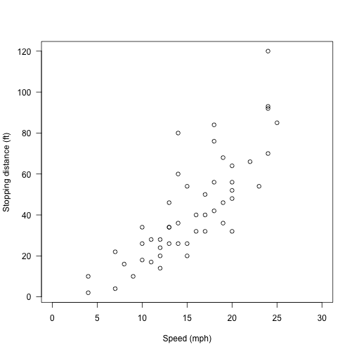
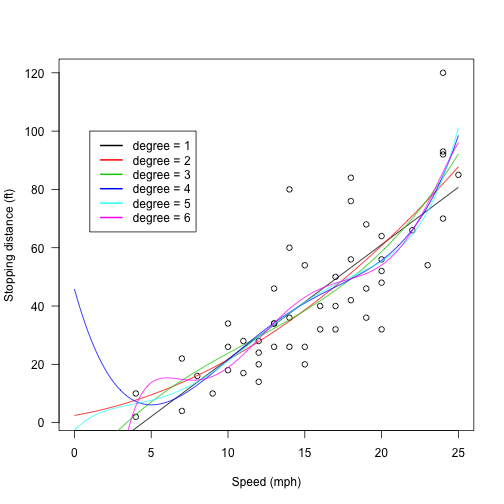

## The cars dataset

1. From the datasets package
    
    ```
    ## 'data.frame':	50 obs. of  2 variables:
    ##  $ speed: num  4 4 7 7 8 9 10 10 10 11 ...
    ##  $ dist : num  2 10 4 22 16 10 18 26 34 17 ...
    ```

2. Data is consists of 50 records of 2 columns
3. Explanation of variables
    a. dist: stopping distance (in feet)
    b. speed: speed of car (in M.P.H.)

    
    ```
    ##   speed dist
    ## 1     4    2
    ## 2     4   10
    ## 3     7    4
    ```


--- .class #id 

## The scatterplot of the cars dataset

 

---

## Polynomial fittings with degree from 1 to 6

 

--- &radio
## Question 1


What is the best polynomial model?

1. _1_
2. 2
3. 3
4. 4

*** .hint
The simplest model with significant p-value is the best polymonial model

*** .explanation

```
## Analysis of Variance Table
## 
## Model 1: dist ~ poly(speed, degree)
## Model 2: dist ~ poly(speed, degree)
## Model 3: dist ~ poly(speed, degree)
## Model 4: dist ~ poly(speed, degree)
##   Res.Df   RSS Df Sum of Sq      F Pr(>F)
## 1     48 11354                           
## 2     47 10825  1    528.81 2.3108 0.1355
## 3     46 10634  1    190.35 0.8318 0.3666
## 4     45 10298  1    336.55 1.4707 0.2316
```
All higher degree models are not significant, therefore the first order linear model is the best model


